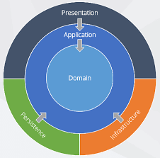

# Advanced Notes
This project has been developed with Domain Driven Design (DDD) principles in mind. This lead to an architectural structure with proven separation of concerns and high scalability and maintanability capabilities. 

The project is then structured into 4 different layers:

* **Domain:** It is the main sphere of knowledge or activity we are trying to model in the context of our application. Contains representation of business entities and rules that are deeply connected to the company internal processes and the organization itself. This concepts are not likely to change (ideally they never do).

* **Application:** It is the layer Use-Cases belong to. It contains the application logic built on top of the  "domain". This layer is likely to change faster. 

* **Infrastructure:** It represents the actual "physical" infrastructure supporting our application (network protocols, relational databases, dev frameworks, etc.). The "application" layer communicates with the "infrastructure" through abstract "repositories". Actual implementations of repositories are provided to the application layer from the outside, generally through Dependency Injection mechanisms. Working with abstractions effectively creates a sealed boundary between layers.

* **Presentation:**  It is intended to display information to the user and to handle user interaction. In other words this layer enables  Use-Cases to the final user. "Presentation" is connected to the "application" via abstract modules that expose interfaces that clearly describe the Use-Case.

